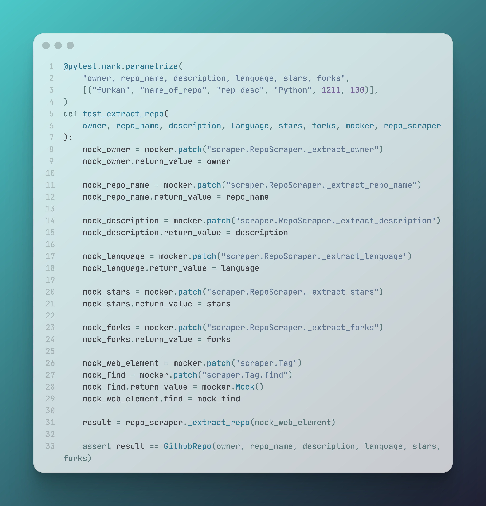

# Web Scraping Project with Python - Github Trendings Scraper

An advanced web scraping tool with OOP design and data analysis capabilities.

## :dart: Project Overview

This project can scrape trending repositories from github.
Scrapes dailt, weekly, or monthly trending repositories from page https://github.com/trending/?since=[daily, weekly, monthly].

## :white_check_mark: Key Features

* **Object-Oriented Design**: Class and object based design for robustness
*            **Type Safety**: Type hints for parameters and attibutes.
*          **Data Analysis**: Data analysis capabilities with pandas.
*         **Format Support**: Repos may be saved in CSV or JSON files.
*            **Unit Tested**: All components and classes are tested.

## :wrench: Technologies

* **Python 3.12**
* **BeautifulSoup4 - HTML Parsing**
* **Requests - HTTP requests**
* **Pandas - Data Analysis with DataFrames**

## :closed_lock_with_key: Installation Guide

```bash
pip install -r requirements.txta
```

## 🚀 Usage

```python
# Scrape daily, weekly, or monthly trendings
scraper = RepoScraper()
daily_trendings   = scraper.scrape_page("daily")
weekly_trendings  = scraper.scrape_page("weekly")
monthly_trendings = scraper.scrape_pafe("monthly")

# Save the repository data into CSV or JSON files.
csv_daily  = "daily.csv"

RepoWriter.save_to_CSV(csv_daily, daily_trendings)

json_daily = "daily.json"
RepoWriter.save_to_JSON(json_daily, daily_trendings)

# Analyze the data
analyzer = RepoAnalyzer(daily_trendings)
analyzer.with_substring("Python", "description")
print(f"Number of repos that contain 'Python' in their description: {analyzer.count()}")

analyzer.clear() # Clear all the filters.
``` 

## 📊 Example Output
```
==== ANALYSIS ====
Totally 13 repositories found.
Most starred repository: 
Owner          : furkankaradumaan
Repository Name: github-trendings-scraper
Description    : github trendings scraper project.
Language       : Python
Stars          : 48987
Forks          : 6674
```
## 🎨 Code Highlights

This test function is a good way to test functions that use another functions. In this
example we mocked all the dependent functions and set the return values.

## 👤 Auhtor

Furkan Karaduman - Week 1 Project
Computer Vision Learning Journey

---
